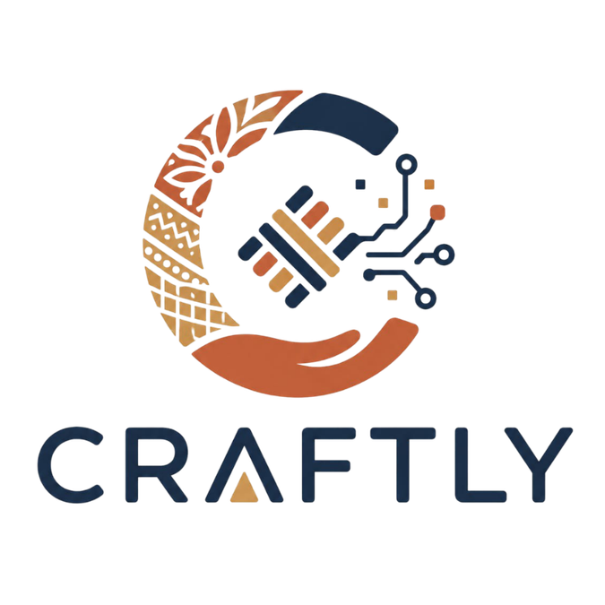

  
  <h1>CRAFTLY</h1>
  
<b>An Artificial Intelligence-Based Platform to Empower Local Artisans and Micro-Entrepreneurs in Indonesia</b>

  

### ▶ About This Project

This project is a **Front-End Prototype** directly adapted from the scientific essay titled **"CRAFTLY: AN ARTIFICIAL INTELLIGENCE-BASED PLATFORM TO EMPOWER LOCAL ARTISANS AND MICRO-ENTREPRENEURS IN INDONESIA"**. 

The concept was developed in **2026** by a delegation team from **Universitas Islam Negeri (UIN) Ar-Raniry, Aceh, Indonesia**. The development team consists of:
* **Cut Zahra Nasywa** (Leader)
* **Muhammad Hafash** (Member)
* **Alya Rossa** (Member)

CRAFTLY serves as a technological solution utilizing Artificial Intelligence (AI) to empower local artisans and micro-entrepreneurs in Indonesia. The platform is designed to tackle challenges related to digitalization, market access, capital limitations, and export bureaucracy. Utilizing a Penta Helix collaboration framework, the platform synergizes the government, academia, business community, media, and civil society into a fair and inclusive digital ecosystem.

---

### ▶ Core Features

The CRAFTLY platform is engineered with 7 (seven) core features centered around optimizing and automating the business operations of local artisans:

 
A digital record feature that stores personal and business data of Indonesian artisans, including their craft specialization, production capacity, and family background. This data enables the AI to deliver curated information tailored to the artisan's needs and allows local governments to monitor and support them effectively.

 

 
An AI-powered system providing real-time information on raw material availability, sourcing recommendations, and production planning. The platform projects material requirements based on order volumes and seasonal trends, ensuring production capacity aligns perfectly with market demands.

 

 
A business insight hub curated by AI specifically for artisan communities. It delivers data on market trends, popular product categories, pricing benchmarks, and creative design inspiration, alongside AI-driven trend forecasting to help artisans plan future production.

 

 
A transparent digital storefront and trading ecosystem. This feature ensures artisans can market their handmade products with fair price segmentation that reflects true production value, entirely free from exploitative intermediary practices. Buyers and exporters can also view available stock and production capacity projections.

 

 
An automated business management tool integrated with AI. It provides production scheduling, monthly performance projections, and periodic evaluations aimed at elevating the economic and social welfare of artisan communities.

 

 
A funding venue that connects artisans directly with investors, cooperatives, and interested public members. By displaying business profiles and AI-tracked performance improvements, artisans can secure capital for long-term needs, while simultaneously opening complementary business opportunities (like packaging or logistics) for their family members.

 

 
A vital breakthrough feature designed to open international market access for micro-scale artisans. The CRAFTLY system automatically handles the entire, traditionally complex export administration process, allowing the artisans to focus purely on the quality and cultural authenticity of their handmade crafts.

---

### ▶ Technology Stack

This UI/UX prototype is built independently utilizing modern web technologies to ensure a lightweight, responsive, and backend-ready architecture:

  
  
  

 

* **HTML5:** Semantic structuring for the web application.
* **Tailwind CSS:** A utility-first CSS framework utilized to create a consistent, modern, and highly responsive interface across all devices (Mobile, Tablet, Desktop).
* **Vanilla JavaScript (ES6+):** Handles interactive prototype logic (e.g., AI Chatbot simulation, tab switching, pop-up modals, and product filtering) without relying on heavy external libraries.

   
  <i><b>Realizing the Vision of Golden Indonesia 2045</b></i> 
  
The creation of the CRAFTLY prototype represents a fundamental step by the UIN Ar-Raniry team in translating academic research into a tangible solution. It aims to transform local cultural heritage into a resilient, independent, and sustainable micro-economic pillar.

